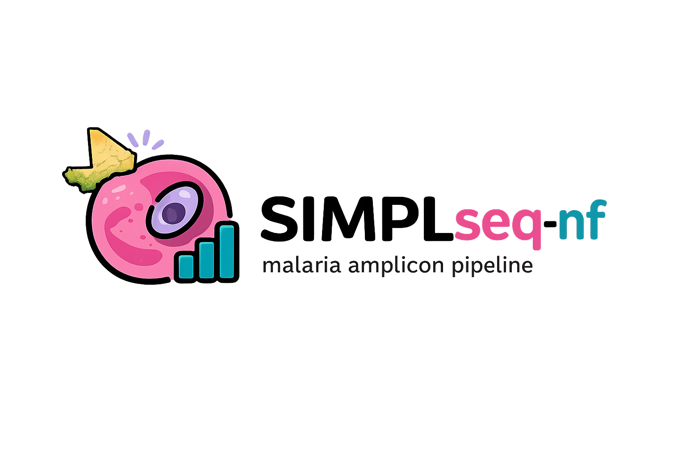

<p align="center">
  
</p>

# SIMPLseq-nf App

SIMPLseq-nf App is a local browser app for SIMPLseq malaria amplicon sequencing runs. It scans paired FASTQ files, runs the SIMPLseq Nextflow workflow, and shows SIMPLseq, DINEMITES, and dcifer results in your browser.

Your data stays on your computer.

## Install

Install on Linux, WSL, or macOS:

```bash
curl -fsSL https://github.com/a-nadeem9/simplseq-malaria-amplicon-pipeline-nf/releases/download/v2.2.1/install-simplseq.sh | bash
simplseq run
```

The app opens locally at an address like:

```text
http://127.0.0.1:8501
```

## Use The App

1. Open the app with `simplseq run`.
2. In **Inputs**, choose the folder with your paired FASTQ files.
3. Click **Scan folder** to create `samples.csv`.
4. In **Run**, click **Run runtime check**.
5. Click **Start run**.
6. Use **Results** to view reports and download output files.
7. Use **DINEMITES** for new-infection analysis.
8. Use **dcifer** for pairwise relatedness analysis.

## FASTQ Names

Supported paired-read names include:

```text
*_R1.fastq.gz / *_R2.fastq.gz
*_R1_001.fastq.gz / *_R2_001.fastq.gz
*_R1.fq.gz / *_R2.fq.gz
*_R1_001.fq.gz / *_R2_001.fq.gz
```

The app writes a sample sheet named `samples.csv`. You can edit it before starting the run if sample names or dates need correction.

## Main Outputs

Each run writes a new output folder. Common files include:

| File | Description |
| --- | --- |
| `reports/run_summary.html` | Main run report |
| `run_dada2/seqtab_iseq.tsv` | ASV count table |
| `run_dada2/ASV_mapped_table.tsv` | ASVs mapped to SIMPLseq targets |
| `run_dada2/asv_to_cigar.tsv` | ASV to CIGAR haplotype map |
| `run_dada2/seqtab_cigar.tsv` | Final CIGAR count table |

## DINEMITES Outputs

DINEMITES results are written to:

```text
<results>/dinemites/
```

Common files include:

| File | Description |
| --- | --- |
| `dinemites_allele_probabilities.tsv` | Per-allele probabilities |
| `dinemites_allele_key.tsv` | Short allele IDs mapped to exact alleles |
| `dinemites_new_infections.tsv` | New-infection summaries |
| `dinemites_molfoi.tsv` | molFOI summaries |
| `dinemites_plots/` | Subject plots |

## dcifer Outputs

dcifer results are written to:

```text
<results>/dcifer/
```

Common files include:

| File | Description |
| --- | --- |
| `dcifer_coi.tsv` | Complexity-of-infection estimates |
| `dcifer_pairwise_relatedness.tsv` | Pairwise relatedness estimates |
| `dcifer_relatedness_matrix.tsv` | Relatedness matrix |
| `dcifer_pvalue_matrix.tsv` | Raw p-value matrix |
| `dcifer_plots/` | Relatedness heatmaps |

Raw dcifer p-values are exploratory unless allele frequencies come from an appropriate background population.

## Notes

- Linux, WSL, and macOS are supported.
- Apple Silicon Macs require Rosetta because the app uses the Intel Conda runtime for DADA2 compatibility.
- The app installs a managed runtime under `~/.local/share/simplseq/`.
